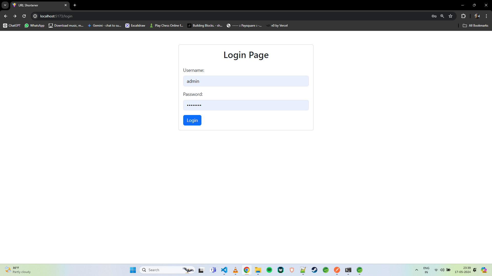
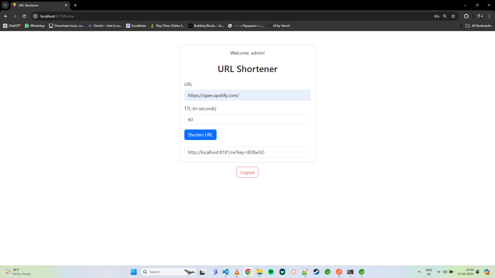

# URL Shortener

## Description
This project is a URL Shortener service built using React for the frontend and Java Spring Boot with JDK 17 for the backend. It utilizes Redis for storing shortened URLs. You can run the Redis in WSL mode.

## Features
- Shorten long URLs into concise, shareable links.
- Redirect users from shortened links to original URLs seamlessly.
- Simple and intuitive user interface built with React.
- Efficient backend powered by Java Spring Boot.
- Redis integration for fast and reliable URL storage and retrieval.
- URL expiry configurable
- If not configured by default it's set for 60 seconds post which URL will be automatically destroyed (default value can be configured for higher interval)
- Authentication is added using react only (admin is the default username and password is configured as password)
## Setup Instructions
### Prerequisites
- WSL (Windows Subsystem for Linux) for Redis server
- Node.js
- JDK 17

### Installation
1. Clone this repository to your local machine.
   ```bash
   git clone https://github.com/chinmay-sawant/URLShortener

2. Navigate to the frontend directory and install dependencies.
   ```bash
   cd url-shortener/frontend
   npm install
3. Navigate to the backend directory and configure the application.properties as per the requirements and run the Spring Boot application.

4. Ensure Redis is installed and running.
   ```bash
   Open WSL
   sudo systemctl restart redis-server
   redis-cli -a redispass (password for my user)
   ping -> pong
5. Start the frontend and backend servers.

6. Access the URL Shortener application in your browser.
   ```bash
   http://yourreacturl:port/login

### Usage
1. Enter a long URL into the provided input field on the homepage.
2. Click the "Shorten" button to generate a shortened URL.
3. Copy the shortened URL and share it with others.
4. Users can now use the shortened URL to access the original long URL.

### Contributors
Chinmay Sawant

### Screenshots



